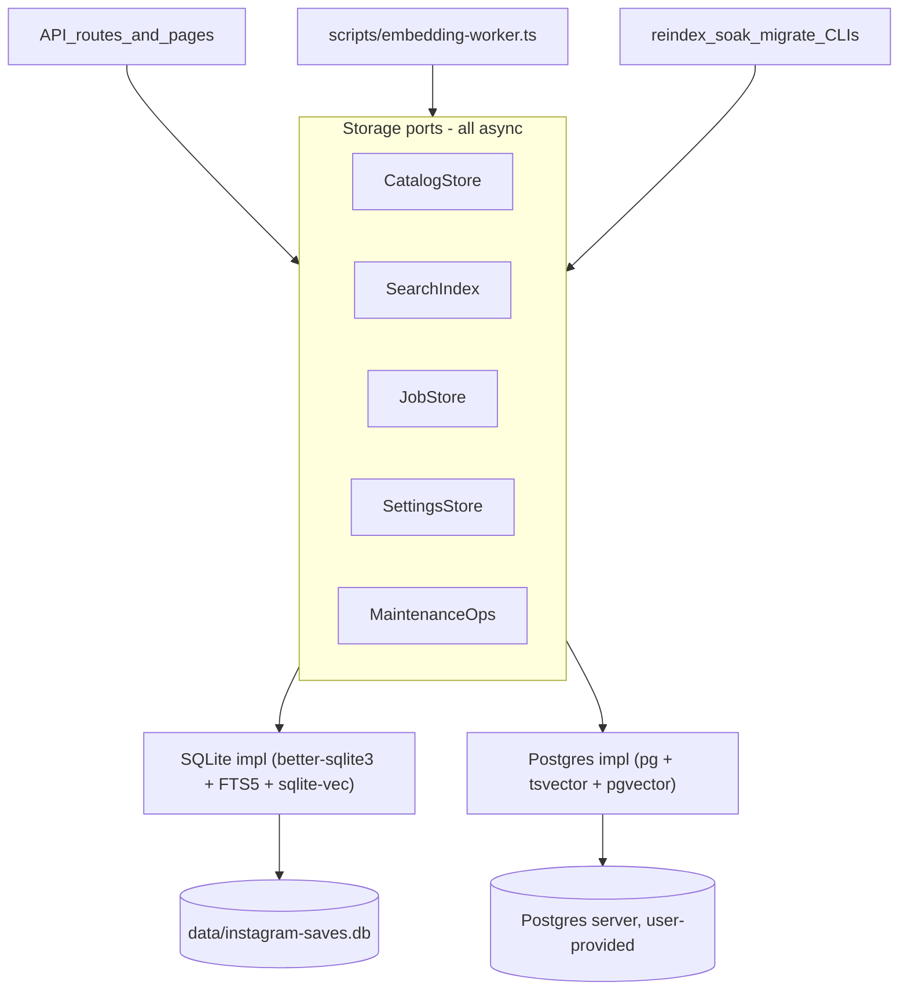

# Multi-Engine Database Support (SQLite default + Postgres)

Status: **ME-6 complete — migration-first engine switching** (Aug 2026). The
multi-engine rewrite is complete. Settings migrates the existing library when
switching engines by default; starting with an unused empty target is an
explicit secondary action. `migrate:engine` remains available for offline ops.

Goal: refactor from hard-wired better-sqlite3 to an async port-based storage
layer with two full backends — SQLite (default, embedded) and Postgres
(node-postgres + pgvector + tsvector, user-provided server) — selected by
config, with Drizzle Kit migrations per dialect and an engine-to-engine data
migration tool.

Decision record: PGlite was evaluated and rejected as the embedded Postgres
flavor (alpha status, single-process data-dir ownership incompatible with the
embedding worker child process, 0.x on-disk format churn). The Postgres
backend targets real servers only.

## Phase checklist

- [x] Phase 1: Define async port interfaces (`CatalogStore`, `SearchIndex`, `JobStore`, `SettingsStore`, `MaintenanceOps`) and move existing SQLite code into `src/lib/storage/sqlite/` behind them
- [x] Phase 2: Async-ify all call sites (routes, pages, SSE snapshots, scripts, worker), remove `getSqlite()` defaults and top-level HMR ensure, adapt existing tests; full suite green on SQLite
- [x] Phase 3: Move all plain tables to Drizzle schemas per dialect with Drizzle Kit migrations; shrink hand-rolled DDL to FTS5/vec0 (SQLite) and journaled extension/tsvector/vector SQL (PG); stamp empty SQLite databases at v10 and reject legacy/non-empty unstamped files; rewrite `docs/db-boundary.md`
- [x] Phase 4: Postgres Pool/migrations, all five adapter ports, tsvector/pgvector storage, lease reclaim, maintenance/reset, engine-aware UI, distance parity, docker-compose recipe, and port-routed import/embedding runners
- [x] Phase 5: Shared port contracts against SQLite and optional environment-provided Postgres; Docker-free default tests, `test:pg`, engine-selectable soak, and documented optional Postgres browser smoke
- [x] Phase 6: Bidirectional SQLite/Postgres library migration with identity preservation, empty-target refusal, Settings progress/status, and an optional explicit fresh switch

## Target architecture

Engine selection: `INSTAGRAM_SAVES_DATABASE_URL=postgres://…` selects
Postgres; otherwise SQLite at `INSTAGRAM_SAVES_DB` (current default path). A
`getStorage(): Promise<Storage>` factory replaces `getSqlite()`/`getDb()` as
the app-wide entry point (cached on `globalThis` like today, in
`src/lib/storage/index.ts`). Connection lifecycle lives in
`src/lib/storage/sqlite/connection.ts`; `src/lib/db/index.ts` keeps internal
compatibility re-exports while app call sites use the ports.

## Phase 1 — Define ports and restructure the SQLite code behind them

Create `src/lib/storage/ports.ts` with async interfaces derived from today's
exact call surface:

- **CatalogStore** — everything in `src/lib/queries.ts` and
  `src/lib/schema-catalog.ts`, plus import writes: `applyParsedItems` /
  `applyLikedItems` / `persistImportSchemas`
  (`src/lib/import/write-batches.ts`), `appendImportNotes`,
  `countPersistedImportRows`, `rollbackImportInserts` /
  `discardImportInserts`. Batch transactions stay inside the impl.
- **SearchIndex** — FTS upsert/remove/count (`src/lib/search/sync-fts.ts`),
  vector store ops + profiles (`src/lib/search/sync-vec-store.ts`), row
  loaders (`src/lib/search/sync-rows.ts`), keyword+vector query primitives
  used by `src/lib/search/hybrid.ts`, vec integrity, gap assessment.
  Engine-neutral logic (RRF fusion, chunking, resume policy, rebuild
  orchestration in `sync.ts` / `sync-embed.ts`) stays shared and calls the
  port.
- **JobStore** — `embedding_jobs` + `import_jobs` CRUD
  (`src/lib/search/jobs-records.ts`, `src/lib/search/jobs.ts`,
  `src/lib/import/jobs.ts`) and reclaim (`src/lib/job-queue.ts`).
  Runner/spawn policy (jobs-spawn, worker-policy, memory gates) stays shared.
- **SettingsStore** — `app_settings` KV
  (`src/lib/settings/app-settings.ts`); env-fallback resolution stays shared.
- **MaintenanceOps** — busy state (`src/lib/settings/library-busy.ts`),
  maintenance actions + stats (`src/lib/settings/db-maintenance.ts`), reset
  (`src/lib/settings/reset-library.ts`), integrity check, plus an
  `engineInfo()` capability descriptor (engine name, supported maintenance
  actions, search tech labels for UI copy).

Move current code to `src/lib/storage/sqlite/` as the first implementation,
preserving behavior exactly (WAL pragmas, sqlite-vec load, schema ensure,
orphan reclaim on open, `EMBEDDING_WORKER_CHILD` skip).

## Phase 2 — Async-ify every call site (still SQLite-only, no behavior change)

All port methods are async; the SQLite impl fulfills them trivially. Convert
the known hard spots:

- Remove module-top-level HMR `ensureDatabaseSchema` in `db/index.ts` → lazy
  `getStorage()` with cached init promise.
- Eliminate all `sqlite = getSqlite()` default parameters (sync-fts,
  sync-vec-store, sync-rows, app-settings, vec-integrity) — ports are
  injected/resolved instead.
- SSE stream routes (`src/app/api/import/jobs/stream/route.ts`,
  `src/app/api/search/status/stream/route.ts`): make `getSnapshot` async in
  `createJobSseResponse`.
- Sync server components → async: `src/components/overview-dashboard.tsx`,
  `src/app/import/page.tsx` (other DB pages are already async).
- Replace `sleepSyncMs` (`Atomics.wait`) in the reclaim path with async sleep.
- Update all 20 API routes, remaining pages, and scripts
  (`embedding-worker.ts`, `reindex-search.ts`, `soak-scale.ts`) to `await`
  the ports.
- Adapt tests that mock `getSqlite` or build `:memory:` DBs
  (`db-maintenance.test.ts`, `library-busy.test.ts`, `job-queue.test.ts`,
  `vec-integrity.test.ts`, `hybrid.test.ts`, `readiness.test.ts`,
  `fault-inject.test.ts`, Gate A harness) to construct the SQLite storage
  impl directly.

Exit gate: `pnpm test:all` + e2e green, app behavior-identical on SQLite.

## Phase 3 — Migration system: Drizzle Kit for everything expressible

- Expand Drizzle schemas to cover all plain tables: catalog (already there) +
  `app_settings`, `embedding_jobs`, `import_jobs`,
  `embedding_index_profiles`. Two schema files:
  `src/lib/storage/sqlite/schema.ts` (sqlite-core) and
  `src/lib/storage/postgres/schema.ts` (pg-core).
- Two drizzle-kit configs and migration folders (`drizzle/sqlite/`,
  `drizzle/postgres/`). SQLite migrations run programmatically at storage init
  via Drizzle's migrator; the Postgres journal is ready for the ME-4 connection
  bootstrap.
- Hand-rolled DDL shrinks to a per-engine `ensureSearchSchema`: SQLite keeps
  FTS5 + vec0 create/recreate from `src/lib/db/ddl.ts`; Postgres uses
  custom-SQL migration files for `CREATE EXTENSION vector`, tsvector
  generated columns, and GIN/HNSW indexes (drizzle-kit supports raw SQL
  migrations, so these still live in the journal).
- Greenfield transition: v10 accepts only an empty database (then applies the
  journal) or an already journaled v10 database. Versions 1–9 and unstamped
  non-empty files are rejected with a wipe/reimport instruction.
- Rewrite `docs/db-boundary.md`: new rule set (Drizzle Kit owns plain tables
  per dialect; hand-rolled SQL owns virtual/extension DDL only; ports own all
  access).

## Phase 4 — Postgres backend

Implementation status: complete. The Pool bootstrap, Drizzle migrator, all five
concrete port adapters, engine-selected factory, engine-aware UI labels/actions,
Docker pgvector recipe, and normalized-vector distance conversion tests have
landed. Import lifecycle/catalog writes, import and embedding job mutations,
provider settings, FTS/vector rebuilds, vector queries, readiness, and status
now route through the storage ports. A boundary regression test prevents direct
SQLite APIs from returning to runner files.

`src/lib/storage/postgres/` implementing all five ports over a `pg` Pool:

- **Schema mapping**: identity columns for autoincrement PKs;
  `timestamptz`/epoch handling replacing `unixepoch()`; per-library
  search-doc tables `saved_items_search` / `liked_items_search` (denormalized
  author/shortcode/media_key/media_type/collections-or-source, tsvector
  generated column, GIN index) maintained by the same delete+insert pattern
  as FTS5 today; embeddings as
  `saved_item_embeddings(item_id, provider, embedding vector(1024))`
  (PK `(item_id, provider)`) + likes twin, exact `<=>` KNN with optional HNSW
  partial indexes per provider.
- **Search**: `websearch_to_tsquery` + `ts_rank` replaces `MATCH`/`rank`
  (port of `buildFtsQuery`); KNN via `ORDER BY embedding <=> $1 LIMIT k`.
  Validation item: sqlite-vec `vec0` defaults to L2 distance while pgvector
  `<=>` is cosine — confirm the current metric and normalize
  behavior/thresholds (`VEC_DISTANCE_MAX`/`SLACK`) so RRF ranking stays
  comparable across engines.
- **Jobs**: identical columns and lease semantics (`worker_pid`,
  `lease_expires_at`); the embedding worker child keeps its process design,
  opening its own connection — reclaim's `/proc` cmdline probe is
  engine-agnostic and unchanged.
- **Maintenance/reset**: `VACUUM (ANALYZE)`, `pg_database_size`,
  `pg_stat_user_tables` dead-tuple stats; no WAL checkpoint → capability
  flags drive the UI. Reset via ordered `TRUNCATE … RESTART IDENTITY` +
  search-doc/embedding truncation + spool clear.
- **UI/copy adaptation**: `src/components/db-maintenance.tsx` renders
  engine-provided stats/actions; hardcoded "FTS5"/"sqlite-vec" strings in
  `saves-browser`, `likes-browser`, `overview-dashboard` come from
  `engineInfo()`.
- **Provisioning**: `docker-compose.postgres.yml` using a pgvector image +
  `.env` example; runbook section for backup (`pg_dump`) and ops.

## Phase 5 — Test infrastructure for two engines

Implementation status: complete. `src/lib/storage/contracts.test.ts` registers
one shared suite against SQLite `:memory:` and, when reachable,
`INSTAGRAM_SAVES_DATABASE_URL`. Missing/unavailable Postgres is a clear skip
locally, so `pnpm test:unit` stays Docker-free. GitHub Actions `contracts-pg`
starts a `pgvector/pgvector:pg17` service, sets the URL, and runs
`pnpm test:pg` (fail-loud if the URL is set but Postgres is unreachable).
`pnpm test:contracts` is the same suite without requiring Docker.

The contracts cover all five ports, including import-adjacent catalog writes
and rollback, FTS, normalized 1024-dimension vector ranking, embedding/import
job lifecycles, settings, busy-state enforcement, integrity, and reset.
`scripts/soak-scale.ts` accepts `--engine=sqlite|postgres` and uses storage
ports for count and integrity assertions. Gate A remains in `test:all`, while
its database behavior is exercised through the shared storage contracts.
Optional Postgres Playwright smoke is documented as an environment-selected
run rather than adding Docker Compose to CI.

## Phase 6 — Engine-to-engine migration tool

Implementation status: complete. Settings uses the same copy path for the
default engine-switch action and reports table/vector/search/integrity progress
over SSE. `pnpm migrate:engine` provides the equivalent offline operation with
explicit source/target flags. Both preserve catalog and import IDs, collections,
schemas, settings, embedding profiles, and vectors; CLI job history is copied
only with `--include-jobs`. Search documents are rebuilt from the copied catalog.
The operation refuses a finished non-empty target and verifies target integrity.

Crash-safety residual (ME-6): a kill mid-copy must not leave a silently
half-migrated target that the app treats as valid. SQLite copies into
`*.engine-migrate` then atomically replaces the destination. Postgres writes
an `engine_migration` `in_progress` marker before copying; `getPostgresPool`
refuses that database; retry wipes the in-progress target (or the operator
`DROP`s the database) and runs `pnpm migrate:engine` again. There is still no
dual-read of old databases.

The Settings default is **Migrate library**. **Switch empty / start fresh** is
secondary, requires typed confirmation, and accepts only an unused empty target.
There is no dual-read, dual-write, legacy-schema upgrade, or automatic migration
during app startup.

## Key risks

- Distance-metric parity (L2 vs cosine) between sqlite-vec and pgvector —
  must be validated in Phase 4 before hybrid thresholds are trusted.
- The Phase 2 async conversion is the widest change surface (~40 files, 20
  routes); it lands as pure refactor with the full test suite as the gate
  before any Postgres code exists.
- The greenfield SQLite gate must continue rejecting legacy and unstamped
  non-empty files while allowing empty and already journaled v10 databases.
